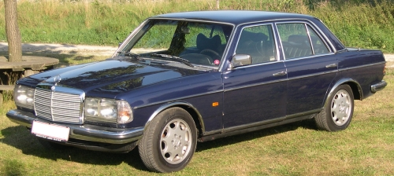

**I LEFT WORK** early today to do some Christmas present shopping, but following [Murphy's law](http://en.wikipedia.org/wiki/Murphy's_law "Murphy's law: Whatever can go wrong, will go wrong"), starting the car was a no go. Engine cranked, but didn't start and just left an oder of unburned fuel. Its no big surprise though. I've almost always driven old cars, and its been a reoccurring theme that, when a rainy fall becomes frosty winter, car trouble begins.

Currently I drive a [1976 Mercedes-Benz 280 (W123.030) Automatic](http://www.geocities.com/SiliconValley/Pines/6633/w123.html).  Generally its a very reliable car and apart from some regular engine tuneups, it otherwise never breaks down.

Its not the frost it self that give the problem, its more the preceding endless amounts of rain thats giving trouble. When its raining the electrics eventually starts to behave faulty, and when wet electric components begins to freeze, the electric problems just becomes worse.

The tendency I see from my history of car troubles is, that it seems that the fall has become more and more rainy during the last years, and the frost season begins later and later - makes me think, that I probably should replace that old polluter of a car, with a more environmental friendly one.

By the way, getting the car started was simple (tried it may times before ;-). I used a hairdryer to dry up the sparkplug cables, and bingo, the engine started perfectly.
