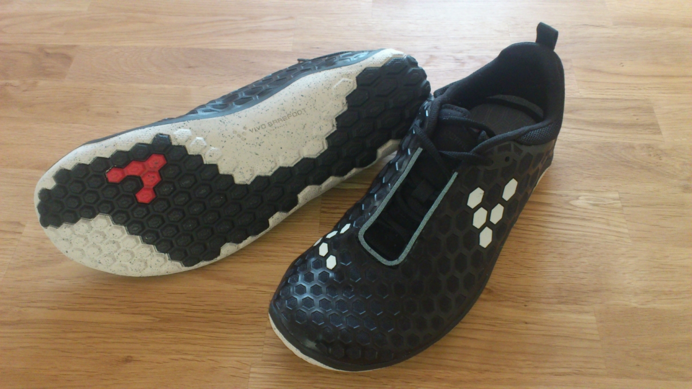

**BAREFOOT RUNNING HAS** become quite popular, and now I have joined in on this running trend.

Last summer I saw Martin Toft running in his [fivefinger shoes](http://martintoft.dk/wordpress/?p=544). They looked weird `:-D` but I was also quite intrigued of the concept of down to basics running. Martin seems to be quite hooked on the barefoot running concept and I've followed some of his [blogging](http://martintoft.dk/wordpress/?p=1036).

The idea of barefoot running is to nay the modern shoes, and return to the natural inherit principal of running barefoot (or with only very thin shoes). The theory is that this would make you a better and more natural runner, and reduce the risk of injuries significantly. I've been prone to get lots and lots of injuries during running, so the last "promise" was the sales-point for me.

So the shoes (Vivobarefoot Evo II) are bought, but first I have to [unlearn old running habits](https://www.youtube.com/watch?v=Jio7DK15Q1E), adopted from modern cushioned running shoes. An exciting and well run spring ahead I hope `:-)`

