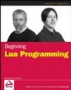

**I BOUGHT THIS** book as a supplement to [Programming in Lua, second edition](http://monzool.net/blog/2007/08/09/programming-in-lua-second-edition/) in hope of getting things explained with more practical examples.

Thankfully this is also the case for this book. There are many programming samples in this book that all takes great effort in elaborating the features or problems of the topic at hand. The book starts out with the usual history lessen, but there after gets straight to the business of teaching Lua programming at beginners level. Beyond the explanation of variables, program flow controllers, calculation with numbers and string operations the writers spend lots of time explaining the immanent dynamic nature of Lua. Lua provides only a few versatile variable types and enforces only a few rules to what can't be done, but for people not used to static language programming, it sometimes can be hard to wrap your mind around the dynamic possibilities. Luckily this book excels with thorough explanations along with carefully designed samples, all together giving great help during the learning process.

Overall I think this is a very good book for Lua beginners. It starts out with the basics and progresses to more advanced Lua programming topics. Especially the chapters explaining the inner workings of Lua and how to debug Lua applications are excellent qualities of this book. Otherwise the book covers in more or less details, just about all thinkable aspects of the Lua language, ranging from simple scripting to embedding Lua in C/C++ applications. And as a good jumping board into further Lua adventures, the book finishes of with some very good chapters describing how Lua can be used and extended with various 3rd party libraries.

A bit disappointing about this book however, is the minimal attention devoted to explain the object oriented capabilities of Lua. This is a powerful feature set of the language that deserves much better exposure than what is included in this book. Another negative remark to the book is that the writers sometimes derail the context flow, and suddenly explain topics in sections or chapters where the topic otherwise seems unrelated and not directly associable.

Regarding the object oriented features of Lua, I have personally used this feature to convert some Python and Ruby scripts to Lua, and this was done with minimal effort thanks to the simple but versatile object system offered by Lua. Some would argue that OO issues would belong in a professional edition of the book but I disagree. There is not much more to tell about Lua than otherwise covered in this book. Except for the OO system, the rest is more a matter of "practices makes perfect".

**Rating**: ⭐⭐⭐⭐☆
