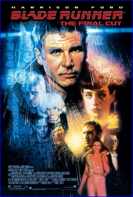

**BLADE RUNNER HAS** been one of my [favorite movies](http://monzool.net/blog/category/entertainment/movies/) since the first time I saw it.

I've always hoped that I would get chance to see Blade Runner on the big cinematic screen, but hadn't really believed that an old 1982 movie would get big screen time. But suddenly the chance came up, as [BioCity](http://www.biobooking.dk) in Århus arranged a special marathon, dedicating one show room for continuously playing _Blade Runner - Final Cut_ at all time slots for almost an entire week. The sensation was enhanced by the fact that the movie was projected from a digital copy with a high resolution projector. What a fantastic picture quality! This was the first time I've seen a digital movie projected at the cinema - and what a debut experience with such a picture-beautiful movie as Blade Runner. This is how movies should be seen.

Definitely worth the almost 150 kilometer drive.

**Rating**: ⭐⭐⭐⭐⭐
