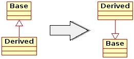
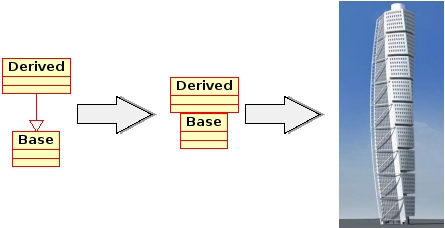
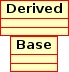

**WHEN BEGINNING C++** programming I've experienced people to have trouble remembering the correct construction and destruction call order. Personally I conquered this using a common memory technique - creating a story.

Here are two stories that might help in remembering. The stories might seem quite long, but don't fear, it's not necessary to remember the stories word by word. Btw. the storytelling does not fly 100\[%\], but they are good enough... at least for me ;-)

#### Story #1: The Skyscraper

The skyscraper story is exemplified from this simple class structure:

```cpp
class Base
{
  Base() { cout << "Base" << endl; }
};

class Derived : public Base
{
  Derived() { cout << "Derived" << endl; }
};

```

A couple of prerequisites are necessary:

1) Imagine the UML class diagram of the above turned upside down.



2) Imagine that the each class in the upside down diagram represents a floor in a skyscraper.



The `Base` is the _foundation_ and all `Derived` objects are _floors_ that builds upon that foundation.

 `Start constructing here --->`

So to construct a skyscraper the building process must be `Base` first, then `Derived` next, as buildings ([usually](http://en.wikipedia.org/wiki/BMW_Headquarters "BMW Headquarter")) are build from bottom and upwards.

When destructing the destruction order is the same as dismantling a building, top to bottom.

`Start destructing here --->` 

So what about the special case of destruction when the object is polymorphic?

When allocated is looks like its a building with only a base level; even though we know its a building two storages high.

```cpp
Base* pBase = new Derived;

```

The problem here is that the demolition team only have access to the base level and when destroying the building, disaster will happen...

```cpp
delete pBase;

```

As the building **is** two storages high, it will collapse when the supporting foundation is removed first (allegorizing a bad situation as the `Derived` object would not get destroyed when only deleting the base object).

So how to fix this situation? You provide the demolition team with an _elevator_. The "elevator" is a special demolition model called `virtual`.

```cpp
class Base
{
  Base() { cout << "Base" << endl; }
  virtual ~Base() { cout << "~Base" << endl; }  // Virtual destructor
};

```

As the building is equipped with an elevator the demolition team can escalate to the top of the building and begin the destruction from top to bottom and get everything removed properly.

#### Story #2: File Manipulation

The second story relate the base/derived situation to file contents manipulation.

A file must be opened before it can be closed, and if opened it must be closed again at some point. Thus it make sense to create a class that opens the file in the constructor, and closes the file again in the destructor.

```cpp
class FileAccess
{
  FileAccess() { cout << "Open file..." << endl; }
  ~FileAccess() { cout << "Close file..." << endl; }
};

```

Read and write operations are similar functionality (transfer data, but in opposite direction) and thus it makes sense to collect this functionality in one class. As the goal is to modify the contents of a file, the reading of the existing file content can be placed in the constructor, and writing of the modified content in the destructor.

```cpp
class FileManipulate
{
  FileManipulate() { cout << "Read from file..." << endl; }
  ~FileManipulate() { cout << "Write to file..." << endl; }

  // Content manipulation functions follows here...
};

```

Two classes are now at hand. One that opens and closes a file, and one that reads the contents of the file and writes it back to the file.

A prerequisite of reading from a file or writing to a file is that the file is open. Therefore the basic but essential functionality of opening and closing is made the base class (`FileAccess`). The more advanced and flexible functionality of reading and writing is then made in the derived class (`FileManipulate`).

```cpp
class Base /* FileAccess */
{
  Base() { cout << "Open file..." << endl; }
  ~Base() { cout << "Close file..." << endl; }
};

class Derived /* FileManipulate */ : public Base /* FileAccess */
{
  Derived() { cout << "Read from file..." << endl; }
  ~Derived() { cout << "Write to file..." << endl; }
};

```

Thus every time an object is created of the derived class for modifying a files contents, it automagically also inherits the capabilities of opening and closing files. And as a file cannot be read from before the file is opened, it can be remembered that the base constructor must be called before the derived constructor. Equally it cannot be written to the file after the file is closed, thus is can be remembered that the derived destructor is called before the base destructor.
