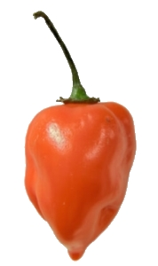

**A FLAMING SENSATION** it was, when I tasted my home cooked Chili Con Carne today.

As usual when making Chili Con Carne, I stopped by the groceries to get some fresh chili's. Normally I have to spice it up with some chili powder though, otherwise the chili flavor would not be very distinct, as grocery chili's is most often the "safe" kind that most people can eat without bursting into flames. Well, not the case this time. The wrapped [Habanero chili's](http://en.wikipedia.org/wiki/Habanero_chile "Habanero Chili") had a warning sticker saying "Very hot", but thats what the always say, I thought.

Maybe I should have read a bit about this particular chili before dismissing the warning sticker. Well, I'm a bit wiser now. Habanero chili is **hot** - and I have the burn marks to prove it :-D
