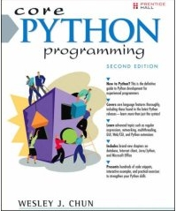

**I CONSIDER MYSELF** at beginner level on Python programming. I've [played with Python before](http://monzool.net/blog/2007/10/15/html-parsing-with-beautiful-soup/) at a very basic level, but my experience is, that to really learn a programming language, you have to get a book written by a writer that knows the language well. Looking around the world wide web, the [Core Python Programming (2nd edition)](http://www.amazon.co.uk/Core-PYTHON-Programming-Wesley-Chun/dp/0132269937) by [Wesley J. Chun](http://roadkill.com/~wesc/res1.html) came highly recommended from various Python and book review sites - so I bought it.

The book covers a lot of things. Starting with a chapter giving a quick Python tour with a page or so introduction to most aspects of the language. It then moves on to the type system, file handling, conditionals, error handling, functions and classes. Finally more advanced things as regular expressions, networking and web programming is covered.

From the above, and from its contents table, it looks like a neatly structured book, but in reality all chapters have a little of everything tossed in.

The book is presented as a book for the technical person already familiar with programming and/or students. This book tries to ride two horses at once. Many things are explained for the absolute beginner in painstakingly long stories, however the incoherent chronology of the book demands programming knowledge and is just flawed from a beginners point of view. Furthermore, a mistake constantly made in this book is the use of explaining things or showing examples with topics not covered yet. Two examples could be introducing list comprehensions and generator expression by using lambda's and yield examples. Lambda's and yield statements however aren't treated until chapters later and no explanations or forward references are given. Trying to grasp Python from self studying a book, then explaining new stuff with other new non-explained stuff is just plain stupid.

Another frustrating thing of structure in this book, is how topics are scattered though out the book. A dedicated chapter exists for all topics, but it is often quite shallow. Tragedy is that almost exclusively the index only lists the dedicated chapter pages. After quite some reading in the book I had doubts whether Python supported function/method overloading. Given the dynamic type nature of Python, I would expect not - unless different amount of arguments could differentiate definitions. In the index "overloading" only exists in parentheses along side "overriding" and none of the pages listed there gives a direct answer. Reading the book cover to cover, the first direct answer I found was a tiny sentence at page 412 "Because overloading is not a feature ..." in the chapter "Return Values and Function Types". An obvious place to put such information - if you live in [Bizarro World](http://en.wikipedia.org/wiki/Bizarro#The_Bizarro_World)! The statement is repeated a couple of times, along with a note the functionality can be achieved by introspecting the types. For a book constantly comparing Python to C++ and Java, I find it quite a shortcoming that no example of this is given at any point.

The second time around its actually better, cos then your not absorbing introductions to new stuff, but rather exploring things, and in that situation it can sometimes be beneficiary, memory and/or inspiration wise, that other topics are tossed in the mix. What might tick you off though, if using the book more for referencing, are the suspicious lacks in some summary tables. Example: A table of special class attributes are given in chapter "Special Class Attributes" at page 524. At page 595 in a chapter "Advanced Features of New-Style Classes (Python 2.2+)" one discovers that several other special class attributes and methods were added when Python 2.2 was released back in December 2001. This renders the table at page 524 incomplete (and somewhat useless) just because the author hasn't escaped from the past yet. The **crappy index** of course only lists page 524 for class attributes.

Finally, I use color markings a lot (but wisely) when reading technical books. Efficient color marking is not easy in this book. First of all, the prime sentences and points made are not clear cut and to the point, but often bloated with filler text (the book suffers badly from the well known "American book syndrome" of using many many words to tell almost nothing). Secondly the paper is very transparent. It's not particular thin paper - just highly transparent? Yellow marking is fairly visible on the backside of the marked page - and forget about using other colors. I would have preferred the publisher had cut 10% of the \[filler\] words and printed the book on less transparent paper.

From the above (rant?) its obvious that I don't like the way the book is structured. But its not all bad. Especially there are some excellent diagrams and charts in the book that give good overview and understanding; and in fairness, I **did** gain Python knowledge from it. It covers nearly all aspects of Python, and on completion you have a solid base for Python programming. A word of advice though if planning on using this book for self studying. If your a beginner to Python buy another book, read online tutorials, or even ask your grandmother - just don't buy this book! If your intermediate or advanced do the same - your money would be wasted.

**Rating**: ⭐☆☆☆☆
