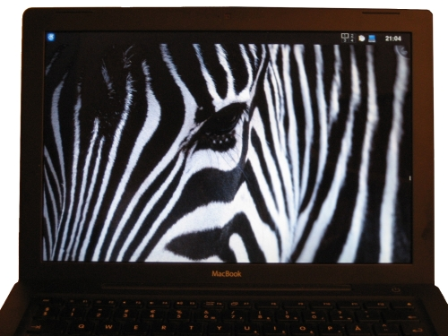

**LIBERATED AT LAST**. No more torment and self-punishment of using [Mac OS X](http://en.wikipedia.org/wiki/Apple_Leopard). I finally caved and wiped the Apple operating system from my Macbook and installed [Debian](http://www.debian.org/) and [KDE 4](http://www.kde.org/announcements/4.0/). Sweet.

For a long time I've been reluctant to wipe the Mac OS X. I wouldn't just give up on Mac OS X that easy. If so many people finds it that great, why did I keep hitting shortcoming after shortcoming and stupidity after stupidity?

If I should list what I like about the Mac OS X, I could list three things: Front-row is a pretty good media center. Mac OS X boots really fast. I like the zebra wallpaper - I kept that.

As for reasons that I don't like the Mac OS X experience I could list a few. For example: [Finder](http://www.apple.com/macosx/features/finder.html) sux bad and is slow as molasses and stupid. The terminal is broken. I hate when CD's won't eject. Its frustrating that wireless cannot reconnect after standby. Hate those stupid obscure keyboard shortcuts. Feel back at Window 2000 with software updates that requires rebooting. I loathe those giant updates to iTunes which I rarely used. The multi-workspace concept in [Spaces](http://blogs.sun.com/bblfish/entry/why_apple_spaces_is_broken), its borked. The hibernation support is lousy at best. Hate that stupid inefficient application task switcher. And not by fault of Apple, I'm unhappy with the endless row of bad Total Commander/Krusader clones. I'm also irritated on an almost endless row of broken macports and broken fink ports.

It actually required two attempts to get the Macbook up and running. On the first attempt I followed the directions from the [Debian Macbook Wiki](wiki.debian.org/MacBook), which preach that Lilo must be install for a later replacement by Grub. After installing Grub it was no longer possible to boot. On the second attempt I installed Debian like normal, and chose Grub as boot manager. Then it worked. Actually in a few other occasions I got into troubles when following the guides. It seems that the Debian Macbook Wiki is somewhat outdated on certain areas, as some special "jumping though loops" measures are no longer required, but would rather get you into trouble. Installing the 915resolutions package for example, crashed my X, but was in fact not necessary to get the prober resolution anyways. However it provides many valuable informations and links, and generally ease the installation considerable.
