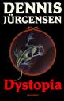

**THE BOOK DYSTOPIA** is perhaps the best book I've ever read.

It's written by productive Danish writer, director and screenwriter [Dennis Jürgensen](http://en.wikipedia.org/wiki/Dennis_Jürgensen). I am not aware of any English translations, so any non-danish readers are imho robbed of a great read.

In the land of Tarakinien the people of the Blue clan and the Black clan have been battling as long as anyone can remember. A common hope of peace, from the daughter of the one clan Champion and son from the other clan Champion, one day makes the "Bringer of Light" tumble the two youngsters into another world. The hope is that they will unite and bring back peace to their own world. In the new world Dystopia they are given a quest. In order to save their own world they must free this land of Dystopia where darkness is spreading is dominion. In their fantastic journey they are joined by some creatures called the Eudaimon's. The Eudaimon's are a fearsome species that have lived in solitude in the far regions of the forest for many years. The intrusion of the darkness forces them to join forces in a dangerous quest.

The book is written in the normal Dennis' way, so you cannot help getting "into the story" and just keeps reading, chapter after chapter, just to see if they make it though the obstacles. The characters are described so intensely that you find yourself, cheering and wishing for each individual to performs their task with greatness - or at least survives. Even though a 635 pages book, for each paper you flip, you'll curse the book for not having enough.

More information can be found [here](http://tellerup.dk/?Bog=48) (Danish).

**Rating**: ⭐⭐⭐⭐⭐
