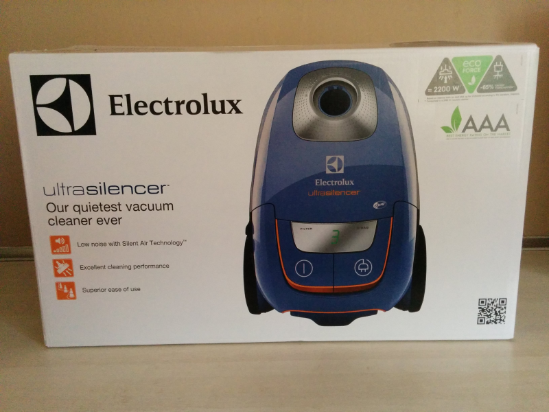
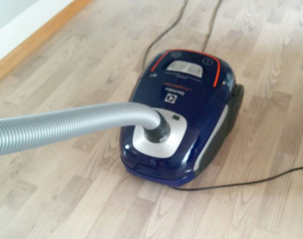
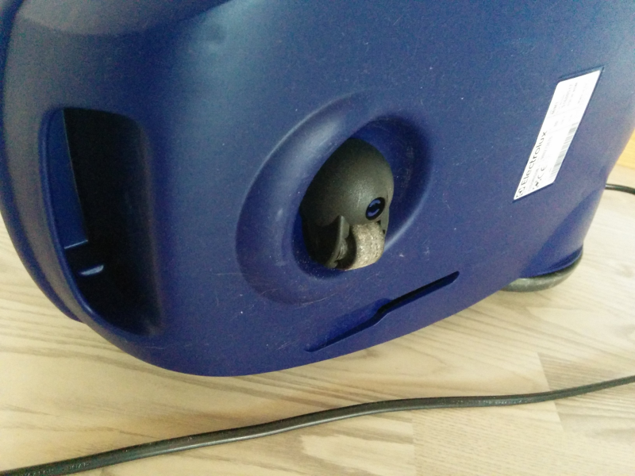
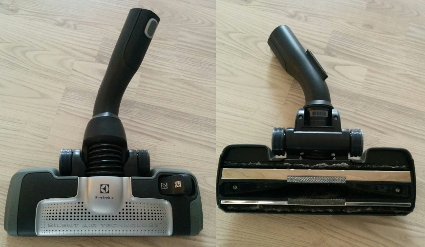
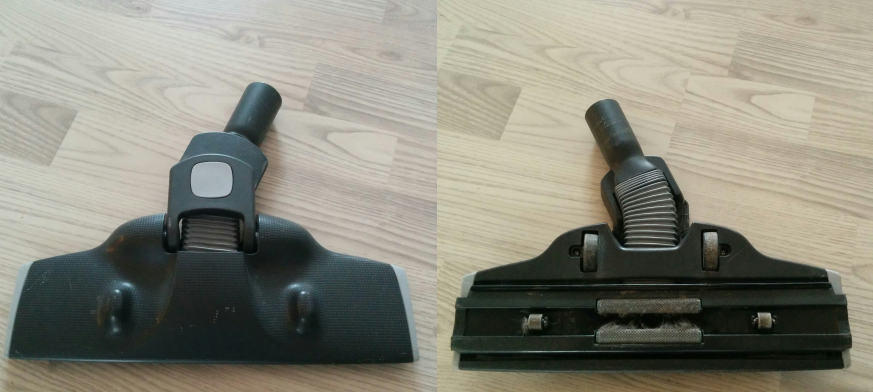

**THE ELECTROLUX ULTRASILENCER** vacuum cleaner (model `ZUSORIGDB+`).

## The Machine

It definitely is a very beautiful and streamlined machine, and it has a very high degree of quality feel to it. The hose, pipe and handlebar is very good quality, makes no noise and is very comfortable to handle. The power of it is extremely good and its power adjustment works surprisingly linear.

The actual use of it, does not measure up to its visual appearance however. I think the mountpoint of the hose is to vertical and placed to long into the machine. The maneuverability of the vacuum machine is really bad. It is very hard to make it move in a straight line, and will instead tumble from side to side. Navigating though door openings is almost unlikely to happen without the vacuum machine straying of and banging into the doorframe. Very frustrating!

Even more frustrating is its inability to roll over its own cord. The is actually a slim and very long cable which give very good reach around the house. I think the front wheel is made to small. Even the tiny diameter of its own cord is enough to make it scoot the cable in front of it, and one has to lift it up to clear the cable.

### Good

- Beautiful
- Very silent
- Extremely powerful

### Bad

- Unstable movement
- Bad with obstacles

## The Silencer Head

The silencer head is indeed very silent. When vacuuming the machine is almost inaudible. A very pleasing experience for your ears. The suction from the head is extremely good. This will clean everything with easy, being it hardfloors, furnitures, car seats, carpets - anything!

There are some serious drawbacks on the silent head though. It is not very flexible and rotates angled on the axis of the pipe. In combination of the oval pipe, which makes it impossible to turn the handle on the pipe, it is almost impossible to twist to reach under couches, low tables and other furnitures. This brings me to another negative point. The head is unusually tall, and too high to fit under my couch at all. The excellent suction of the head, in combination with my hardwood floor makes it necessary to flip out the brushes on the head. I don't really like this option, and never had. After a while the brushes clutter up, and just pushes dirt around instead of letting the vacuum picking it up - especially when having pets. Not a fault of this particular head, but on the old ineffective concept itself.

### Good

- Silent
- Very good suction

### Bad

- Tall head
- Inflexible movement

## Conclusion

It definitely seems like lot of previous learned experiences have been lost, and not transferred on to new products. Or perhaps the product responsible, disregarded other considerations and focused too much on making it ultra silent before usable. A good vacuum cleaner, but not up to expectations `:-/`.

  
  

## Bonus

For my previous vacuum clearer I bought this slimline head, also from Electrolux. This might be the very best head I've ever tried. It fits under the lowest furnitures, is highly flexible in its movement, and is on four wheels for unmatched effortless movement and easy maneuvering.

I use this head instead of the original. It is lifted a bit above the ground, and therefor lets air flow disperse less optimally. This gives more suction noise and reduces suction power, but in combination with the really low noise level of the vacuum machine itself, and its abundance of power, this is a really really good combination.
