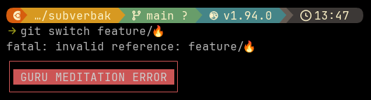

**WORKING FAST AND** furious can be great when you are in the _zone_, but sometimes I work too fast for my own good.

Way too often than I'd care to admit, I will quickly create a new branch:

```bash
❱ git switch feature/🔥
fatal: invalid reference: feature/🔥
```

Then pop the stash and/or do the fast and furious writing thing. Much later I would discover that I had forgotten the `-c` option to actually create a new branch, realizing I just messed up another unrelated branch 🤦

Obviously I need something to bring the error exit more to my attention, so I cooked up this little attention functionality

Now, when git fails, this banner pops up in the shell



Perfect 👌 Not too noisy and and not too big, but enough to catch my attention 🔔

Its a small function added to _.zshrc_. It captures the last command that was run and compare it to git (that part can of course be omitted or changed to any other program). In case of error exit from git, the banner is shown

```zsh
print_error_box() {
    local msg=" $1 "
    local width=${#msg}
    local border

    border=$(printf '%*s' "$width" '')
    border=${border// /─}

    print -P "%F{red}┌${border}┐%f"
    print -P "%F{red}│%f%K{red}%F{white}${msg}%f%k%F{red}│%f"
    print -P "%F{red}└${border}┘%f"
}

typeset -g LAST_CMD=""

preexec() {
    LAST_CMD="$1"
}

precmd() {
    local exit_code=$?
    if (( exit_code != 0 )) && [[ "$LAST_CMD" == git* ]]; then
        print_error_box "GURU MEDITATION ERROR"
    fi
}
```

(source available here: [monzool/shell-command-error-exit-banner](https://github.com/monzool/shell-command-error-exit-banner))
