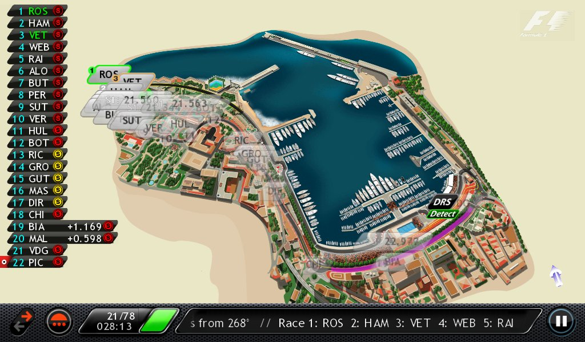
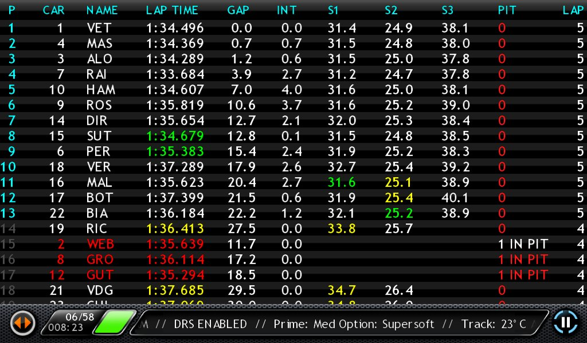

**FOR THE 2013** Formula-1 season I though I would treat my self with buying the official live timing app: 'F1 Timing App 2013' by Soft Pauer Limited. At season start it costed around €22 - a hole lot of money of a one season app. So I had high expectations, but I quickly discovered that the app is utterly superfluous and added zero value to the Formula-1 watching experience  

The app promises the following features: `★ REAL-TIME TRACK POSITIONING ★` `★ FOLLOW YOUR FAVOURITE F1 DRIVER ★` `★ LIVE TIMING DATA ★` `★ LIVE LEADERBOARDS ★` `★ DOWNLOAD RACE PACKS ★` `★ LIVE TEXT COMMENTARY ★` `★ EVENT COUNTER & NOTIFICATIONS ★` `★ KEEP UP TO DATE ★` `★ COMPLETE FORMULA ONE ACCESS ★`

The last one I don't really know what means, but otherwise it sounds awesome. In reality only the _Live Text Commentary_ have any grain of value (it displays some additional official insights into important events happening in the races).

  

The prime feature of the app is the realtime visual overview of car positions on the track.  It sure did sound great, but unless the race evolves into a train-set of cars, the actual overview clutters due to the overlap. And when watching the race, it isn't really an information abstraction that is needed.

  

The secondary high profile feature of the app is the live timing overview.  This would have added great value some many years ago - before the TV transmission began showing equivalent information. You don't need a costly app for what you can already see on the TV.

  
All in all, a costly app that has appalling scarce value. A lesson learned, which I will not repeat
