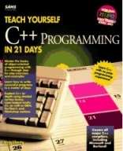
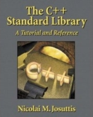
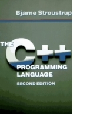
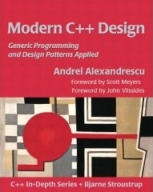
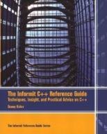

**C++ BOOKS IS** something I've read quite a few of during the years. Having [learned my lesson on buying Python books](http://monzool.net/blog/2008/03/21/core-python-programming), I would like to share the five C++ books I value the most, and which I would not hesitate to recommend to others. The books target audience range from absolute beginner to advanced programmer.

 I learned C++ programming from the book [Teach Yourself C++ in 21 Days](http://www.amazon.co.uk/Sams-Teach-Yourself-C%2B%2B-Days/dp/0672305410/ref=sr_1_6?ie=UTF8&s=books&qid=1206652233&sr=8-6). Everything that the book _Core Python Programming_ does wrong, this book does right. It starts with very easy first steps and by top quality examples and well written texts, it gradually adds layer upon layer of increasingly more advanced C++ knowledge. This may in fact very well be the best, and most well written, programming book I've ever read (note that I got the 1994 edition, and haven't read later updated reprints). _Target audience: beginner_. **Rating**: ⭐⭐⭐⭐⭐

 No serious C++ work can be done without the C++ Standard Library. The book [The C++ Standard Library: A Tutorial and Reference](http://www.amazon.co.uk/C%2B%2B-Standard-Library-Tutorial-Reference/dp/0201379260/ref=pd_bbs_1?ie=UTF8&s=books&qid=1206652630&sr=8-1) is a perfect combination of a tutorial and reference book (as the title also states). Don't leave home without it. _Target audience: intermediate, advanced_. **Rating**: ⭐⭐⭐⭐⭐

 The C++ book [The C++ Programming Language](http://www.amazon.co.uk/C%2B%2B-Programming-Language-Bjarne-Stroustrup/dp/0201539926/ref=sr_1_4?ie=UTF8&s=books&qid=1206653108&sr=1-4) is written by its inventor himself, Bjarne Stroustrup. I actually got this book before _Teach Yourself C++ in 21 Days_ but this book is not suited for beginners. This is for advanced C++ understanding, and an indispensable reference book when doing serious C++ programming. _Target audience: intermediate, advanced_. **Rating**: ⭐⭐⭐⭐⭐

 Having read - and understood - the books above, one might get the urge to learn some advanced techniques on templates. For that the cult book [Modern C++ Design: Applied Generic and Design Patterns](http://erdani.org/book/main.html) is highly recommendable. This relatively thin book is written precise and to the point. Even though the topics covered are advanced, the author takes great care of explaining the details. (Sadly I seldom get the opportunity of doing such C++ hacking covered in this book). _Target audience: advanced_. **Rating**: ⭐⭐⭐⭐⭐

 A bit of a joker is the book [The Informit C++ Reference Guide: Techniques, Insight, and Practical Advice on C++](http://www.informit.com/guides/guide.aspx?g=cplusplus). This book is a gold mine of tips, tricks and examples spanning the entire spectrum of C++ programming - the title covers the contents pretty well. Its a very informative book that covers a lot of topics but concentrates intelligently on areas that often causes doubts. I find it a real joy to read every time. _Target audience: intermediate_. **Rating**: ⭐⭐⭐⭐⭐
