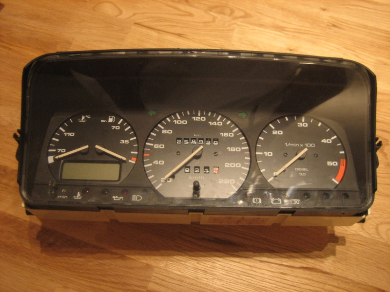
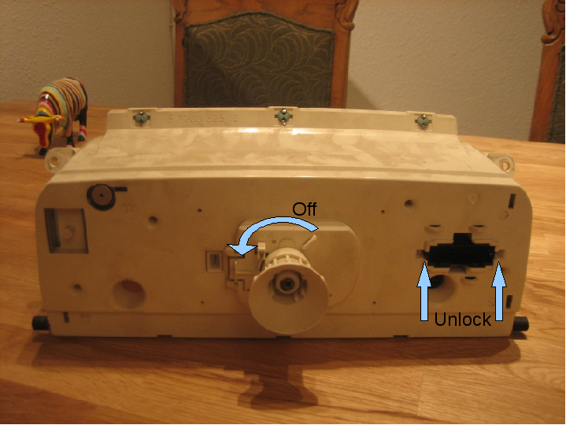
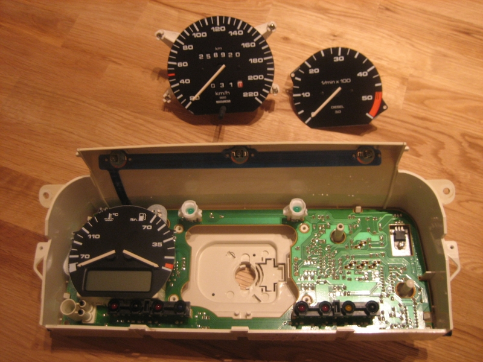
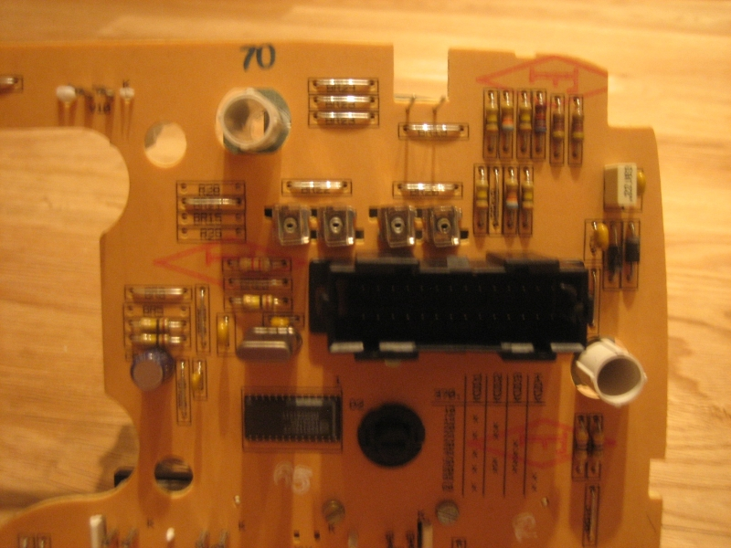
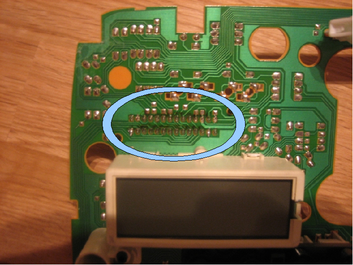

**THE INSTRUMENTAL PANEL** on my 1992 VW Passat was giving some strange readouts on the electrical indicators and warning lights. At first I thought that something was wrong with the temperature censors, so I had en engine block censor changed. That helped nothing, but then other errors began to emerge. For example, the temperature gauge and diesel gauge would sometimes showing erratic values, jumping from one setting to another or just showing obviously false values. The overheating warning light would signal after just starting the engine, or having run only a few kilometers or the headlight settings would indicate the opposite of what was actually set. This [recording](http://monzool.net/blog/wp-content/uploads/2009/01/Instrumental_Panel_FailureSituation2.avi) shows how the gauges head for endpoints and the headlight indicator changes, when switching on the headlights and instrument panel lights. All these issues turned my suspicion towards an electrical error in the instrumental panel; and sure enough it turned out to be an electrical fault. The instrument panel circuit board is connected to external components via a big multi-connector. The soldering for this connector were broken and needed re-soldering.

#### Steps take to make the instrument panel work correctly

To get the instrument box out, the steering wheel has to be unmounted first. The rim around the panel box can be awkward to pull out, but start but pulling the right side first and when that detaches the other side follows easily. The panel box is top mounted with a couple of screws.

When pulling out the panel box the speedometer cable will detach from the box. When refitting the panel box, position the lower part panel box in an outwards angle, and the panel can then be tilted into upright position with the speedometer cable guide right into place.

The speedometer guide is unscrewed in counter-clock wise direction. At the right side of the back cover is a multi-connector. When removing the internal circuit board, this connector has to be unlocked by prying a thin screwdriver (or other fitting tools) into each of the two locking mechanisms.

After opening the box, the gauges are removed. The speedometer is corner screwed while the two other can carefully be pulled of their mountings.

The problem in this case, was the multi-connector slot (here seen from the connector side)

Visually inspecting the pin soldering revealed that most of the pin soldering had gone bad. To fix the instrument panel the soldering had to be redone.

This panel, or variations of, is common to most VW's of late 80's and 90's models and apparently this type of error is not an uncommon failure in these circuits prints.
