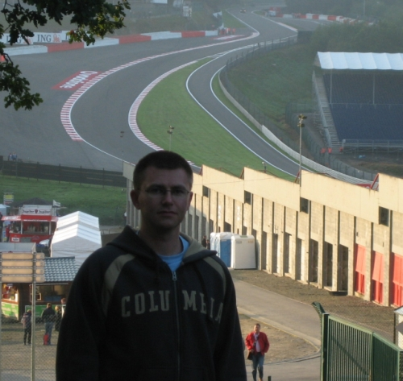

**CIRCUIT DE SPA-FRANCORCHAMPS** is a famous Formula 1 track in Belgium, and this year I, along with two of my Formula 1 enthusiast friends, spend three days watching the race from the the Silver tribune.

One spectacular section on the Circuit de Spa-Francorchamps is the Eau Rouge and Raidillon combination. This is a quit left turn in to an unbelievable steep hill that arcs to the right. Preceding this section is a long downhill stretch, making an excellent overview of a great part of the track. This viewable piece of track made it all worth the money for the Silver tribune seat. The F1 racers will blaze past you so close that its almost frightening, and then they continues up the steep hill so fast you just wouldn't believe it wasn't a cheap sped-up driving movie, if you didn't see it with your own eyes.

Here I have the Eau Rouge / Raidillon combination in the background. 

With my Canon IXUS 50 digital camera I recorded a video of a [Toro Rosso in the second practice round](http://monzool.net/blog/wp-content/uploads/2007/09/Second_practice_Toro_Rosso.avi). This might give some idea of the speed involved (the digital camera is not really suitable for this kind of video recording, so the video quality is not so great).

Wikipedia has extensive information on the technical details of [Circuit de Spa-Francorchamps](http://en.wikipedia.org/wiki/Circuit_de_Spa-Francorchamps "Circuit de Spa-Francorchamps") track.

It was lots of great racing watching in three sunny days in 20-something degrees Celsius and low wind with lots of [waffles](http://en.wikipedia.org/wiki/Waffle "Belgium waffles") of all sorts and plenty of cold [Jupiler beer](http://www.inbev.com/brands/2__5__33__jupiler.cfm "InBev Jupiler") - sweet :-)

However, everything is not perfect at the old Circuit de Spa-Francorchamps stadium, at least at the Silver tribune. A Silver ticket cost around 350€ and include a numbered seat. Sadly the seats are only a plastic platform with no back support. This makes it pretty tough on your back to sit watching racing from 9:00 to 17:00. Further more the track owners made some stupid decisions that limits the view from most of the Silver tribune. The lowest seats sits so low that one almost cannot see above the crash fence. Also the lower seats sits to close to the cross-wired safety fence running in parallel between the tribune and the track, that only a narrow viewpoint straight ahead is available. If looking to the left or right you will see nothing but fence. The middle seats has an important part of their view blocked by a (Vodafone) bill-board, making it impossible to see the cars come out of the La Source corner. Last but not least, the tribune for the Gold tickets is placed after the Silver tribune and blocks the view of Eau Rouge for most Silver seats placed in the section closest to Eau Rouge - all some hard forgivable stupidities. In comparison I was at [Hockenheim in 2006](http://en.wikipedia.org/wiki/2006_German_Grand_Prix "2006 German Grand Prix") and there the stadium offers perfect view and back supported seats for all spectators; actually the surrounding facilities like toilets, shops and exhibitions were better at Hockenheim too :-/

To be fair then its not all bad. In fact most of the middle and top Silver seats have a great view of the track section. I maneuvered my self to a position behind the top row of seats, and had probably the best view imaginable.

All in all it was a great trip and I will probably return there one day for more racing and beer and perhaps some waffles :-).
