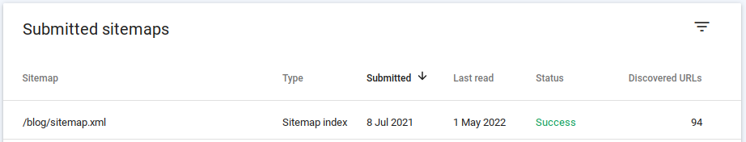
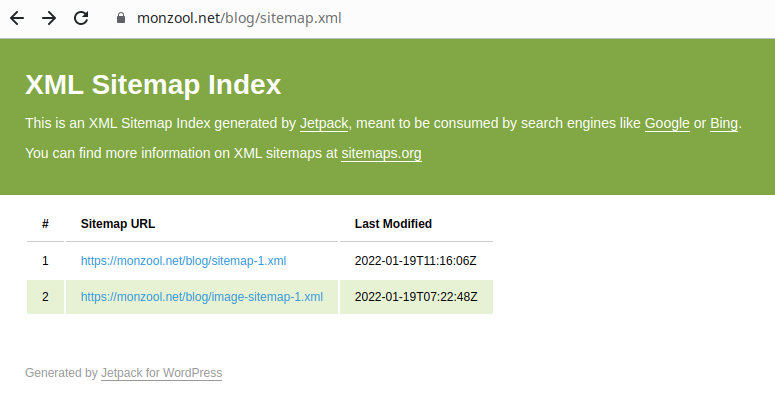
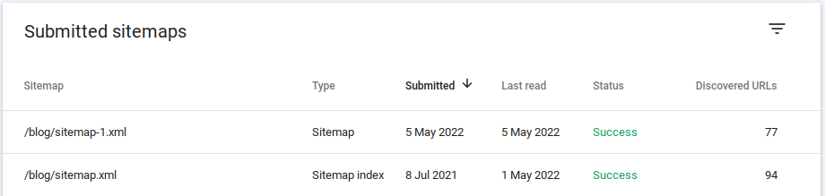

**ON THIS SITE** i've been suffering of an issue with Google forgetting about most of my blog posts...

I would go to the google search engine and type `site:monzool.net` and it would only list about 6 or 7 entries. I then went to the _Google Search Console_ page to see if it could find my unlisted blog posts in the URL inspection tool. It could not.

In the Google Search Console I could also see the sitemap was indexed. I believe that sitemaps are not strictly necessary, but helps indexing robots to map out all the relevant urls of a site.

Looked okay it seemed? 94 discovered urls could be plausible, but a long way from the 7'ish pages actually listed as known by google.

I then looked in a browser at the sitemap url

<figure>

<figcaption>

Not exactly what I had expected, but am not really familiar on how a sitemap should look like. I then looked at the linked _sitemap-1.xml_ file. **That** looked more like what I would expect. A list of urls to all my blog postings. Figured I'd better add that file as a sitemap

</figcaption>

</figure>

Suddenly all my blog posts would list in google!

After adding the last sitemap link, its obvious that the existing file is of type sitemap link. Inspecting the file also reveals that it is a xml file of sitemap files. However only after I added the sitemap manually did it seem to work? But then again, I've had this issue before. Last time I "fixed it" by changing to letting Jetpack handle the sitemap stuff. Hopefully its a permanent fix now
