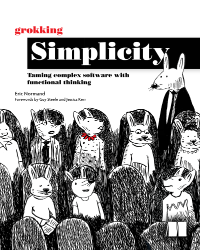
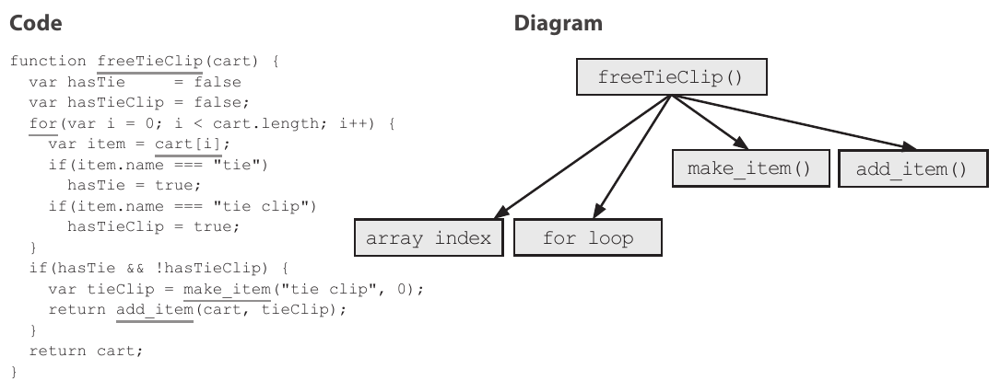
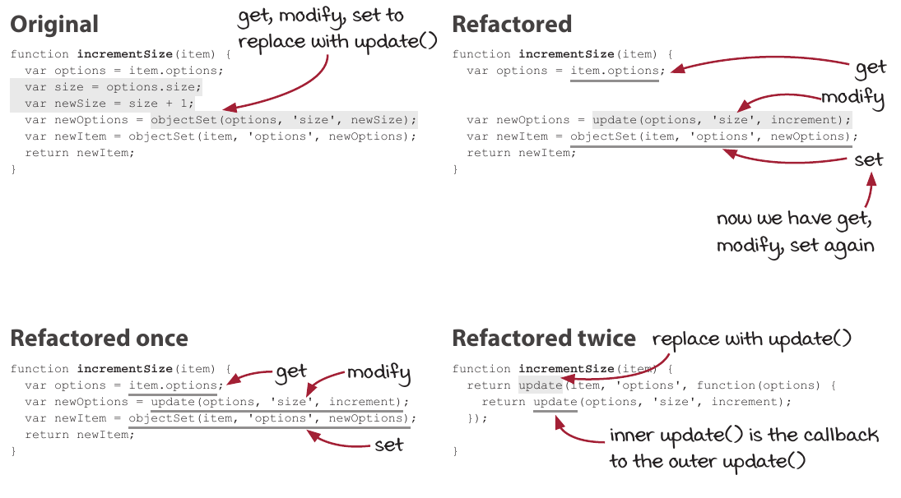
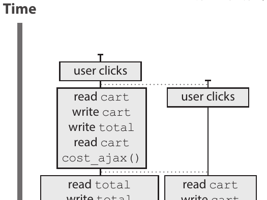
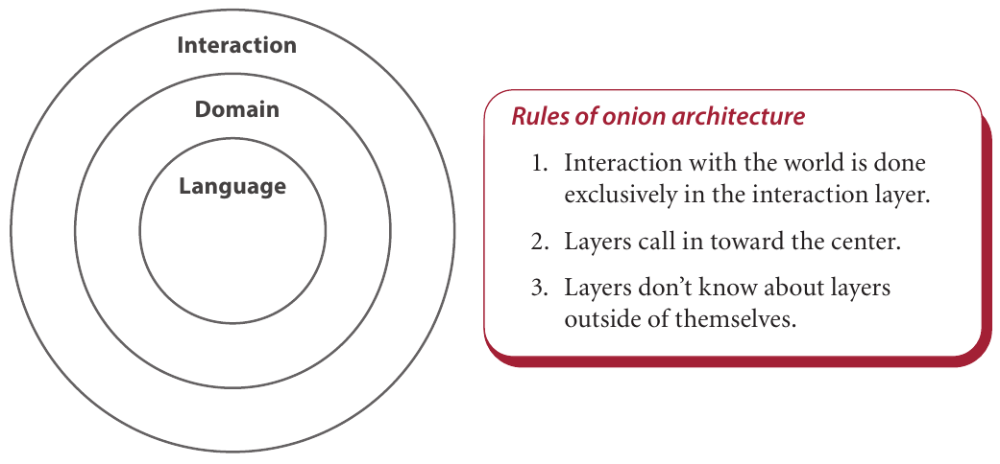

**GROKKING SIMPLICITY IS** a book that shows how to use functional design principals to reduce complexities in software. The books examples are in javascript, but should apply well to C and similar languages also.



## Abstract

### Chapters: Actions, calculations and data

First two chapters are about learning some basic design principals. Three fundamental categories are identified:

- Actions
- Calculations
- Data

In perhaps more common functional terms, _actions_ are _impure_ functions and _calculations_ are _pure_ functions. The reader is introduced to these concept gradually, by a guided tour of refactoring a (obviously worst-case) piece of imperative software. While this is done in iterations, the pros and cons are discussed.

The lesson is to learn how to eliminate implicit inputs and outputs, and how to convert actions into calculations

### Chapter: Improving designs

Some fundamentals about the problems of global variables are discussed, and the reader is then guided through how the example code can be changed to avoid these.

The example in the book is a shopping cart being added with items and a total cost is calculated. The exercise of this chapter is to identify which functions have to many concerns and operate on both the cart and items and even also business logic. The agenda is to separate concerns and then discuss the implications of these refactorings.

Also discussed are how functions that do general things, should not have domain specific namings. The concrete example is a function to append an item to the cart, which essentially is making a copy of the array and returning it with the new item added last. That is refactored like this:

```diff
-function add_item(cart, item) {
+function add_element_last(array, elem) {
```

The point of this chapter is to realize, that only dedicated functions should know the integrate details of the data structures used. These function should then expose general functions. The rest of the code should then only have an opaque knowledge of the data, and instead use the general functions to manipulate it. At the end of the chapter, functions that did actions, calculations and data changing, now only do only of the things.

### Chapter: Immutable in a mutable language

Immutable data has already been introduced, but in this chapter it goes full fletched on immutable data. Functions are identified by their read and/or access to data. Next it is explained how _copy-on-write_ can be used to convert write functions to read functions.

```diff
function delete_handler(name) {
- remove_item_by_name(shopping_cart, name);
+   shopping_cart = remove_item_by_name(shopping_cart, name);
```

As more and more functions become immutable, it is shown how the code can be optimized to only make copies when necessary

The example code in the book is in javascript, and is thus a language with mutable data structures. In javascript `Array.shift` is both a read and write function. An example is made to show how one can create immutable alternatives to the `shift` functionality.

### Chapter: Handle untrusted code

An immutable codebase that has to interact with an mutable codebase, comes with a lot of potential issues. This chapter shows how to use _defensive copying_ as a method to defend the immutable strategy. The chapter also discusses _shallow copying_ versus _deep copying_.

### Chapters: Stratified design

Stratified design is a technique for building software in layers. The book list four design patterns for a stratified design.

This first pattern is “Straightforward implementations” which is about splitting code up for higher cohesion and placing the extracted parts in relevant layers. There is an interesting technique used, where the internals of a function is visualized as a call-graph:



By evaluating the levels of abstraction in the call-graph, it is possible to see what to split out, as **straightforward implementations should call functions from similar layers of abstraction**. With this principal rule, the reader is guided though how to identify how functions access layers, and how to mitigate if the rule is not followed.

The end result is more general functions that allows more code reuse, and a call-graph that reduces “spaghetti code”.

The second pattern is “Abstraction barriers”. This is about creating an api of sorts, where the upper functions do not depend on implementation details of the lower layer. Exposing only opaque data types and general functions help to accomplish this. The concepts is especially useful for delivering functionality to a second development team.

The third, and penultimate, pattern is “Minimal interface”. The agenda here is to provide an _abstraction barrier_ that is sufficient flexible for the layer above the barrier to add additional features from the building block provided by the abstraction.

Last pattern is “Comfortable layers”. This is a reminder that we also need to be practical. In production code the business need will often outweigh the timely efforts of making the perfectly stratified solution. Also highlighted in the chapter is the fact that lower levels carry higher risk. There are some observation about how to three functions in different layers. From that, three nonfunctional requirements rules are identified: Maintainability, Testability and Reusability.

### Chapters: First-class

Here is explained how enumerations and functions can be used as arguments to reduce code duplication, and improve extensibility of functionality without causing great impacts.

It is also shown how _higher-order functions_ can compose new functionality with great flexibility. The example is how to add a logging system to existing code, without having to plaster logging calls all over the code base.

### Chapters: Functional tools

Functional tools like `for-each`, `map`, `filter` and `reduce` are explained along with the benefits they can bring to code. They are very well explained from an imperative standpoint.

Concepts as chaining functions are then covered before continuing on to `update`. When handling nested data, then instead of manually using `get` + `modify` + `set` an approach of using an update function is proposed.



An update function is created that eventually lead into explaining recursion. Also this is explained really well with clear explanations and informative illustrations.

### Chapters: Timelines

The example code in this book, is a web client that put items in a cart. As the client has to communicate with the server for price calculation, it shows a plausible scenario where the timing can go wrong and incorrect totals are presented to customers. For visualizing this, this chapter teaches the reader how to visualize timings with _timeline diagrams_



The chapter also have some good insights on what can go wrong in different models like async, single-threading sync/async and multi-threading. The browsers _job queue_ is also discussed along with ajax requests. A lot of good details are touched in these chapters.

### Chapter: Reactive vs onion design

This chapter starts out by showing how to implement _reactive_ updating (like React etc.). It has a nice story about the pros and cons to such a design and what kind of changes to the system design the reactive strategy entails in regards to decoupling and timelines.

The other design pattern _onion_ is then discussed. The onion design leans into functional programming and strive to separate side-effects from pure functionality.



The signature idea about the onion design align well with the actions/calculation concepts discussed throughout the book:

- Interaction to external entities, is done **only** in the interaction layer.
- Layers call in toward the center.
- Layers don’t know about layers outside of themselves.

There are some great points to how common MVC design patters are not good for functional desires to isolate impure functions. This is what onion design tries to do - keep a clean separation between calculations and actions

## Evaluation

This book is perfect for any typical imperative programmer that have heard all the hype of functional programming merits, but never really grokked how to begin doing actual functional programming. The book gently transforms a typical (albeit worst-case) imperative application to incorporate more and more functional programming functions and design patterns. It does this with clear, and to the point examples. To improve understanding, a lot of really well made informative diagrams, drawings are supplied. Perhaps the best trait of this book, are the many users-stories (from a developer viewpoint) that all helps to understand **why** the proposed changes improves the overall design. The target group for this book is definitely beginner programmers, or people that have no theoretical or practical experience with functional programming concepts; but **if** this fits your bill, you will for sure learn a bunch from this book.

  

Rating: ⭐⭐⭐⭐☆
