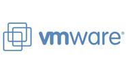

**KDE ON VMWARE** appears to be a combination of instability.

At work I've been running Kde on two [VMware](http://www.vmware.com) Workstation installations, one Suse 10.0 and a Debian unstable. The experience is the same for both installs where the VMware session crashes at least on time a day, but more often as much as three times a day. At work we are four colleagues that are working in a VMware environment and we are all have problems with VMware sessions suddenly crashing. No particular pattern of work seems to provoke the crashes, but experiments show that it is only the Kde + VMware constellation that causes problems. A colleague found that replacing Kde with another window manager makes all the instability issues go away. Hence we have all abandoned Kde for other window managers.

I'm a long time Kde fan and on my personal Debian unstable install, Kde has run for years and it never crashes. Could be interesting to know what Kde is doing that makes VMware spill its guts.

For replacement window manager a couple of colleagues installed Enlightenment, another installed IceWM and I installed Xfce4.4. Xfce4 actually really impresses me. Not only does it look spectacular, but also it's so much more responsive compared to Kde. Of course I cannot work without my trusted Kde applications and tools, but luckely Xfce4 provides optional Kde and Gnome integrations. The really big bonus of Xfce4 is the awesome keyboard nagivation abilities. Xfce4 provides global shortcuts for easy window resizing, moving, maximizing, minimizing etc. Nice `:-)`
