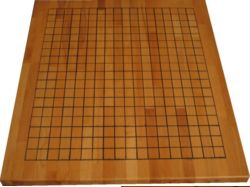

**FOR A COUPLE** of years now I've wanted to learn to play the game of [Go](http://en.wikipedia.org/wiki/Go_\(board_game\) "Go"), but I just haven't managed to find the time. Go is a strategic game for which the saying is "easy to learn, hard \[impossible\] to master".

There exists a brilliant live-cd called [Hikarunix](http://www.hikarunix.org "Hikarunix"). The Hikarunix CD contains a huge set of the quality information on Go found on the internet. A great asset is also the collection of tutorials, trainers and databases over played Go games. In theory Hikarunix bundles all that is required to study, learn and play Go.

Hikarunix is definitely recommendable, but experience tells me, that if you really wanna learn a subject to depth, get a book written by experts in the field and benefit from their hard earned knowledge. Hence I have bought the book [Lessons in the Fundamentals of Go](http://www.amazon.co.uk/Lessons-Fundamentals-Beginner-Elementary-Books/dp/4906574289/ref=pd_bbs_sr_1/202-3853611-7128669?ie=UTF8&s=books&qid=1190877178&sr=8-1 "Lessons in the Fundamentals of Go").

The book comes highly recommended (e.g. from [www.godiscussions.com](http://www.godiscussions.com/go/products/show/75)) so I'm looking forward to reading it.

I am also very exited about playing on my Go board.

This beautiful board is actually handmade by my mother. When wooden Go boards are generally price tagged in range of a [Ariane](http://en.wikipedia.org/wiki/Ariane_5 "Ariane 5 space rocket") space rocket, its nice to have a family that got talent :-)

The wood is a 48.3\[cm\] x 55,5\[cm\] leftover from a kitchen table and then drawing of the grid and cutting grooves for all the lines as well as coloring the lines and applying the sealer is handmade.
