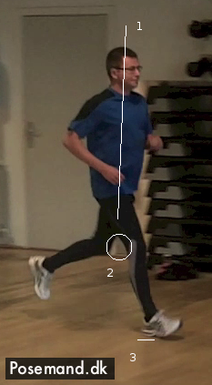
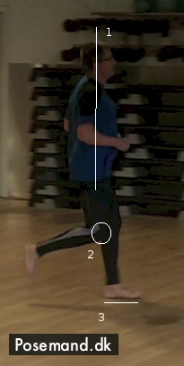

**OMG, I DON'T** know how to run properly `:-O`. That was my realization when I attended a 5 hour training course in barefoot running this weekend, hosted by Claus Rasmussen ([Posemand.dk](http://www.postmand.dk)).

"What?!" you might say. "Running is a no-brainer, just get up, place one leg in front of the other in a fast pace. Everybody can do it". Well think again! Everybody can do it alright, but most have not learned the proper way of running. Running may seem simple but there is a fine technique to it. Shortly described the proper style involves near-flat footed landing and having a tight and balanced body stature when a foot has ground contact.

To see how proper running should like, bring attention to the very best of runners, like marathon runners or sprinters. One example is [Haile Gebrselassie](http://www.youtube.com/watch?v=YSp1r1QhUSY). When observed in [slow motion](http://monzool.net/blog/wp-content/uploads/2013/07/Haile_Gebrselassie_cut_slow.avi) it is quite clear that he has a perfect style. As video documented by Claus the proper running method is actually an inherent "knowledge" in small children, i.e a very natural way of running. But then ,for almost everyone, it gets suppressed later on (via influence by imitation and footwear etc).

  

### Proper Running

Claus' strategy (my interpretation) for achieving better running was very simple:

- Learn the proper technique of running.
- Use barefoot running as a tool for (re)learning how to run.
- Continue to run barefoot to let the body express its natural flow of running to avoid future injuries.

After some background theory we were first filmed running in our normal footwear for progress comparison later on. Then began the training for improved running. Is was a basic exercise but hard to master (basically it boils down to bringing your heels straight up, relaxing and letting your body do the landing).

Before

After

When looking at my _before_ shot, it can be observed `(1)` that I tilt a bit forward. It is clear that I land full bodyweight on my heels `(3)`, and also my landing stand `(2)` is very wide, giving unbalance and energy loss. In the _after_ shot I have bettered my vertical line, lands flat footed and have narrowed my range.

My full progress as recorded by Claus can be seen [here](http://monzool.net/blog/wp-content/uploads/2013/07/posemand_running_course_2013-07_Jan_skriver_soerensen.m4v). It looks a bit funny/weird, but it feels right. And when the technique is learnt properly, one can begin adding speed so it begins to look more natural.
