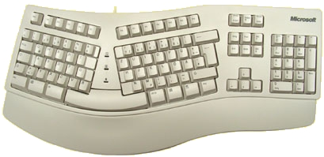
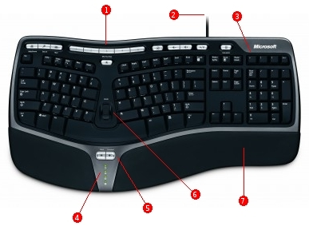

**IT WAS TIME** to finally replace the old dinosaur keyboard. My Microsoft Natural Keyboard at work had sustained some unfixable sticky keys after many years of writings, so a replacement had to be found.

Once more I was thinking of finding another used Microsoft Natural Keyboard (done this before to have a keyboard both at home and at work), but then by coincident, I had a hands on experience on another Microsoft keyboard, the [Microsoft Natural Ergonomic Keyboard 4000](http://www.microsoft.com/hardware/mouseandkeyboard/productdetails.aspx?pid=043). Instantly it was clear - I had to have one!

This is truly an absolutely awesome keyboard! It really feels as good as it looks. Its has some cool features, but most important is that your hands and fingers simply just "fits" the keyboard, and all the frequently used keys are easy accessible. It is clear that it was made for hardcore typing (more information on the design can be found at [Microsoft](http://www.microsoft.com/enable/news/newsletter/oct05.aspx)).

Features include:

1. 1\. Programmable shortcuts.
2. 2\. USB connection.
3. 3\. Additional calculator keys.
4. 4\. Function indicator LED's.
5. 5\. Back, Forward keys.
6. 6\. Zoom/Scroll pin.
7. 7\. Padded hand rest.

The keyboard has just the right amount of special features. No bloating, but keeping it simple with only the most essential functionality (an USB hub could have been nice though).

A killer feature is the "leather-imitate" padded hand rest, which provides really good hand support. This I'm sure will be a relief to my hands when doing long work-stints.

In general I like that the keyboard its not that different from my old Natural keyboard (you know what they say: "If it ain't broken. Don't fix it") so the transition has been easy. However, I did read several [reviews](http://www.codinghorror.com/blog/archives/000400.html "Coding Horror") noticing the slimmed Enter key. I agree that such a modification is not for the better, but on my Danish keyboard layout the Enter key is placed vertically like on the Microsoft Natural Keyboard. I find this layout to be much more friendly for locating the Enter key, so the slimming is not is not that big a deal for me.

As a final note, then I'm sure this ends with me having to buy another one, so that I have one at home for my Linux-box too ;-)

**Rating**: ⭐⭐⭐⭐⭐
