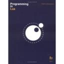

**THIS BOOK IS** indispensable when it comes to Lua programming.

It is written with great insight of the Lua language and its history (not surprisingly as it's written by the creators for the official Lua implementation). The book starts of with the simple stuff and then progresses into the more advanced features, and even though the book is one of the thinner programming books, it manages to cover all aspects in Lua in great detail. This is possible due to the concise and to the point explanations supplemented with programming examples of equal qualities. The Lua concept of a multipurpose variable type called tables is thoroughly explained, also in the regards of utilizing tables for object oriented concepts in Lua. The chapters of embedding Lua into C/C++ programs are very strong chapters, giving invaluable insight and information on the topic. I find myself returning to these chapters when in doubt on Lua and C/C++ interaction principals.

I would not recommend this book as the sole learning book if one is totally new to the Lua language. Several times one is urged to look topics up in the official reference book to totally grasp the situations highlighted. Also no repeating of previously learned facts is done in later pages. This is great if you are on top of things, but if being a complete beginner, repetition helps remembering. The beginner will probably get a more gentle introduction to Lua with the book [Beginning Lua Programming](http://monzool.net/blog/2007/08/09/beginning-lua-programming/ "Programming in Lua, Second Edition"), but "Programming in Lua" is absolutely a must-have for the Lua enthusiast.

**Rating**: ⭐⭐⭐⭐☆
