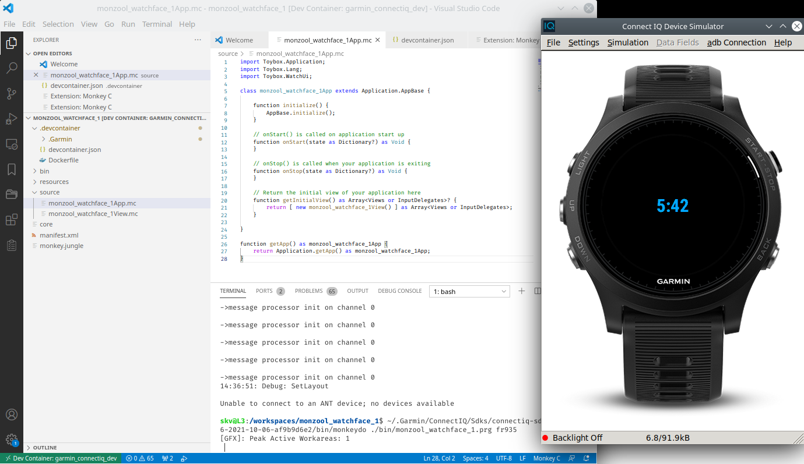

**AFTER INSTALLING GARMIN** Connect IQ SDK on Ubuntu-20, using the script I created in [Installing Garmin Connect IQ SDK on Ubuntu-20](http://monzool.net/blog/2021/10/22/installing-garmin-connect-iq-sdk-on-ubuntu-20/), I realized that building would work fine, but the simulator wouldn't run due to the same dependency issue.

```sh
./bin/sdkmanager: error while loading shared libraries: libwebkitgtk-1.0.so.0: cannot open shared object file: No such file or directory
```

From the installer we know that Docker can save our bacon. Lets make an new container that includes the Garmin installation and have the proper dependencies necessary for running the simulator also. Don't run this manually - we'll make VSCode do this for us ;-)

## Setup

Next we want to be able to use this image in VSCode so that we that run everything from there. For this we need the [Remote Containers](https://marketplace.visualstudio.com/items?itemName=ms-vscode-remote.remote-containers) extension installed in VSCode

```bash
ext install ms-vscode-remote.remote-containers
```

Next install the [Garmin Monkey C](https://marketplace.visualstudio.com/items?itemName=garmin.monkey-c) extension is VSCode.

```bash
ext install ms-vscode-remote.remote-containers
```

With the proper project setup these extensions will allow us to run VSCode within context of the docker image.

Start up that VSCode and use the Monkey C extension and create a new project. Then exit VSCode again. We need to configure the Remote Container extension

In the project directory, create a .devcontainer directory. Put the above Docker file in that directory. Next move/copy the Garmin installation to the directory also (docker won't allow access to copy upper directory files into the container)

```bash
» mkdir my_awesome_project/.devcontainer
» cp -a ~/.Garmin my_awesome_project/.devcontainer/
```

Copy the VSCode Remote Container configuration to the .devcontainer directory.

<script src="https://gist.github.com/monzool/d0db4105cabd9f0a84148f0ea1a99fa0.js"></script>

Finally we need a docker configuration for the container, that the Remote Container extension will utilize

<script src="https://gist.github.com/monzool/df7ff125d5808a71f7c6fd78b84b6403.js"></script>

Copy this to a Dockerfile into the .devcontainer directory also.

The final directory structure should look something like this

```bash
my_awesome_project
├── bin
├── .devcontainer
│   ├── .Garmin
│   ├── devcontainer.json
│   └── Dockerfile
├── resources
└── source
```

We are now ready to boot up VSCode in the container. The Dockerfile is using some environment variables to determine the current user, and duplicate the username (and UID and GID) within the container. This require that VSCode is started with some environment variables set up (there must be a better way to do this?)

```bash
my_awesome_project» USER_UID=$(id -u "${USER}") USER_GID=$(id -g "${USER}") code -n .
```

VSCode will then do a one-time build of the Docker image. After this, and hence forth, when opened in the project directory it will detect the .devcontainer directory and prompt if to reopen the project in the container. Accept this, and you are ready to go.

## Running

Starting the simulator and running the generated basic project



### Aber der bei

Don't know if its the VSCode plugin that a bit brittle still (I believe the Eclipse plugin was the main focus by Garmin until recently), but sometimes I could not get the menus in VSCode to actually do something, so I had to fallback to run the commands directly in the VSCode terminal instead :-/

```bash
~/.Garmin/ConnectIQ/Sdks/connectiq-sdk-lin-4.0.6-2021-10-06-af9b9d6e2/bin/simulator &
~/.Garmin/ConnectIQ/Sdks/connectiq-sdk-lin-4.0.6-2021-10-06-af9b9d6e2/bin/monkeydo ./bin/monzool_watchface_1.prg fr935
```

## Note

While google'ing "Connect IQ docker" I stumbled on the project [kalemena/docker-connectiq](https://github.com/kalemena/docker-connectiq). This looks far more complete than my quick and dirty hacks presented here. I haven't tried the project (mainly to my loathe towards Eclipse), but I think you should consider it first
