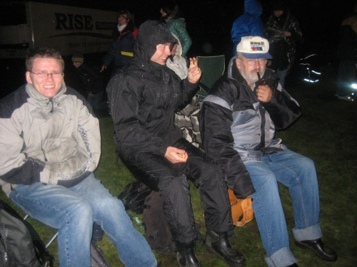

**COLD, WINDY AND** rainy would describe the weather this past Saturday evening. Not that that kind of weather uncommon in Denmark, but this particular day I was at the outdoor [Speedway](http://en.wikipedia.org/wiki/Motorcycle_speedway) event "Denmark vs. The World" at [Vojens Speedway Arena](http://www.speedway.dk/index.php?page=about-us&hl=en_US). Speedway is one of the most exiting motor sport types, and its a fantastic experience to watch it live. This event was a special event where two teams, with Danes on one team and non Danes on the other, would race each other for the price.

Here's a movie that I recorded with my IXUS 50 Canon camera: [Speedway - Denmark vs. The World](http://monzool.net/blog/wp-content/uploads/2008/10/Speedway.avi). Not the best quality, but captures the excitement pretty well.

It was a fantastic evening apart from the fact that the event was canceled after heat 11 out of 18 heats due to bad weather. As this picture will show, we all got a bit surprised on the weather. Here sits my brother, my sisters husband and my father with his Easton cap, all hoping it would stop raining.

I'm somewhat glad that I'm not on the picture - we ain't looking to stylish I guess. _lol_.
