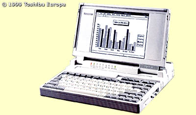

**MY T2000SX LAPTOP** had been a trusty computer for many many years, but all good things come to an end, and now with mixed mind I've tossed it out.

My dad brought it home from work where it, after many years of usage, had depreciated to be worth nothing for a busy corporate business. But for me it was perfect for things like writing homework assignments, playing a game of [Gorilla](http://en.wikipedia.org/wiki/Gorillas_\(computer_game\)) or Pacman, do some programming or connecting homemade electronics to its various ports.

It was a fine machine. It had no color screen or big harddrive or lots of RAM, but it was quite small, handy and low-noised. Some specs. can be found on the [Toshiba site](http://www.toshiba-europe.com/bv/computers/products/notebooks/t2000sx/product.shtm) about the T2000SX.

In the beginning I mainly ran DOS on it, PC-DOS 5.0 I think, but later it was perfect for experiments with FreeBSD or Linux. I've mostly run Linux on it, but lastly it ran a multi-boot between the famous combo installation of PC-DOS 7 + Microsoft Windows 3.11 and an installation of Minix 2.0.0. Fun stuff, and both boots in a few seconds.
