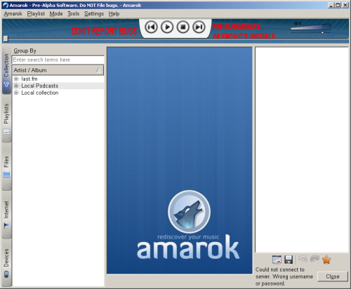
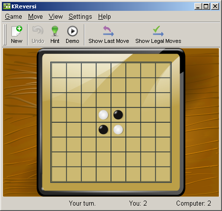
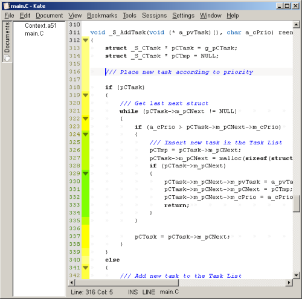
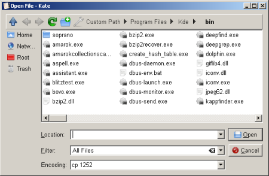

**KDE4 ON WINDOWS** is a very exiting and ambitious project of the people in the [KDE project](http://www.kde.org/). The thought of having all those wonderful KDE applications available whether I'm on my Linux box, my Mac OS X box or even my Windows XP box is very appealing, so I had to give the new KDE-Windows edition a go.

I downloaded the unstable [kdewin installer 0.8.6-beta4](http://download.cegit.de/kde-windows/installer/unstable/kdewin-installer-gui-0.8.6-beta4.exe). The installer provides a package installation like that of the Cygwin installer, were packages are selectable and the necessary dependencies are resolved by the installer.

After a huge download the installation ran but never seemed to finish. After a long waiting period with the computer running at 100% CPU load, but otherwise giving no other indication of activity, I killed the installation process. Regardless of the abrupt termination all files seemed to be installed. I then started kwrite. But it just punished me a sequence of popups of missing dll errors, making me flashback to the Windows 95 or Slackware days of dependency hell. The story repeated on every other program I started. Guess that installer wasn't finish hogging CPU cycles after all. I then started the uninstall, but after an extended period of patience with the CPU at 100% and no other indications of progress, I terminated the uninstall process and deleted the files manually.

After downloading the **stable** [kdewin installer](http://download.cegit.de/kde-windows/installer/kdewin-installer-gui-latest.exe) I wanted to save some installation time and selected only [Amarok](http://amarok.kde.org/). The installer resolved the dependencies to Amarok and eventually completed the installation process. Unfortunately executing Amorak only resulted in a missing prce.dll error - damn it!. I then restarted the installer and discovered an non-installed package `prce.mingw` in the `win32libs` package selection list. After that last install (and a reboot forced by Konqueror freezing the Windows box) Amarok would now start - yeah

Regarding the installation experience, then I think the installer makes a not so positive first impression. A part from apparently missing dependencies, its an extremely long installation duration, all of which it maxes out the CPU load to an extend where it doesn't even manage to redraw its own window. But then again, it needs to copy just about a gazillion files (especially Oxygen has many tiny icon files). Being on an conquest into the Windows world, I think it is somewhat disappointing that no shortcuts are generated to populate program menu (Well not quite surprising I guess. Having seen the [KDE 4.0 keynote presentation](http://video.google.com/videoplay?docid=6642148224800885420&hl=en) its clear that the KDE Windows porters are command line hackers `:-)`)

Now some of the good stuff - for there is plenty of that because most applications works rather well. The games all seem to work perfectly. Here is Kreversi demonstrating how the graphical contents rescaled when its window was resized - kool `:-)`

Most exited I was to try a true KDE "killer-app", the powerful editor [Kate](http://kate-editor.org/). I use that editor a lot in Linux and it would be awesome to use it on a cross platform basis.

The file open menu (here from Kate) is very sweet (e.g. icons on the left resizes as the dialog is resized). I like that Windows Vista style (?) of navigating the directories.

The open file dialog gave me some usability problems though. When I wanted to open a file on another partition I found it very unintuitive to realize, that clicking to the right of the last directory item, changes view to the normal path selection box.

There is still small quirks, like Dolphin started with an error dialog about directory '~' could not be show but would otherwise work just fine, but the general experience is very positive. All work is not done yet, but this is gonna be huge.
