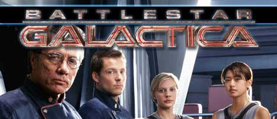

**SOMETIMES IT SEEMS** that I often am the last person in the world to get exited of new television series. Granted that television is crammed with series and keeping up with just a fraction of the lot is an impossible mission. But once in a while a series pops up that just explode in popularity with everybody - everybody except me that is.

Right now I'm crazy about the (ReImagined) series [Battlestar Galactica](http://www.battlestargalactica.com/newbat.htm).

When I saw the first episode on TV I quickly rejected it and zapped on. After some preservation from a friend that is a passionate fan, I borrowed the series to give it another try. After all I just learned my lessen earlier this year when, after much resistance I agreed to watch the series [Lost](http://abc.go.com/primetime/lost/index.html). That series I had rejected as being boring as hell, but on the second try, I was hooked. I consumed one DVD after another in almost spell bound fascination. No one, however told me that the series was only had three seasons completed, so now, like the rest of the world, I'm stuck on a cliffhanger - aarrgh. As for Battlestar Galactica, the history repeats it self. I am absolutely trilled about the series, and being a huge StarTrek fan, I can't comprehend why I didn't find interest in it the first time around?

Actually something similar went for [Buffy The Vampire Slayer](http://en.wikipedia.org/wiki/Buffy_the_Vampire_Slayer).

It just didn't appeal to me the first time. Then I coincedentially saw a rerun of [Buffy The Vampire Slayer](http://www.bbc.co.uk/cult/buffy/) and [Angel](http://en.wikipedia.org/wiki/Angel_\(TV_series\)) one hangover'ed Sunday morning. Now I have both the Buffy The Vampire Slayer and the Angel Collectors box-sets

  

...along with the Buffy The Vampire Slayer coffeecup and T-shirt :-)

I wonder if 24 and Heroes will come back to haunt me later on. I watched the first episode of both series, but I just didn't get interested first time around.
