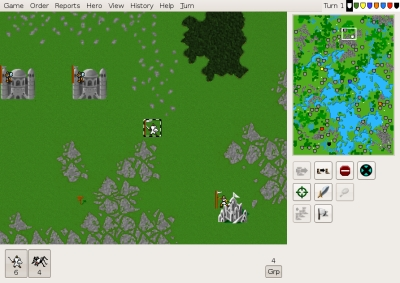
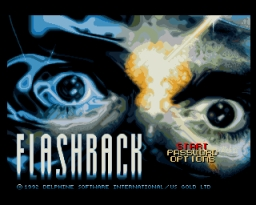
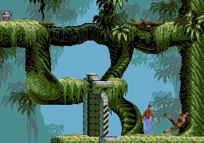
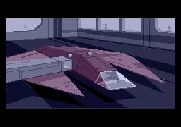
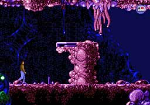
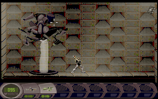
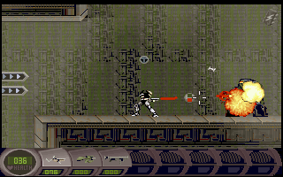

**THE TITLE FOR** this post could almost as well have been _"Warlords II, Flashback, Abuse and How I Spent My Youth_". Well, perhaps not really; I did play a lot of other games too `:-D`. When I think of great games I played in my long "carrier" of PC days, those three games I've always categorized as games with exceptional gameplay and a spellbinding atmosphere. No matter how horrible the graphics may look today, these properties was what kept you playing hours upon hours.

#### Warlords II

When it comes to Warlords II, me and my friend Michael Rasmussen that lived a couple of houses down the street, used to battle in this game for an almost infinite amount of hours - and before that, we played [Warlords I](http://www.warlorders.com/Nav/downloads.html "Download Warlords I") for almost as many hours. Actually when hearing the hours being clocked by people playing [WoW](http://en.wikipedia.org/wiki/World_of_Warcraft) it reminds me of myself playing [Warlords](http://en.wikipedia.org/wiki/Warlords_\(game_series\) "Warlords series"). I guess its the same magic.

Warlords II is reincarnated in an free open source clone [LordsAWar](http://www.lordsawar.com/). This project builds on the C++ implementation of [FreeLords](http://freelords.sourceforge.net/) ( FreeLords it self, seems to have spawned as a Java implementation instead). LordsAWar is a multi platform game and can also be fetched from the Debian repository.

#### Flashback

What Flashback have in gameplay and story it also had in graphics and jaw-dropping animation sequences.

Presented in a dystopian theme, it were almost something like a "Indiana Jones meets Blade Runner" feeling of the game.

  

Flashback is released for Amiga and DOS platforms, but some talented fans have written the game engine [REminiscence](http://membres.lycos.fr/cyxdown/reminiscence/) as a multi platform replacement for the original game engine. Supplying the game data files, downloadable from [Abandonia](http://www.abandonia.com/en/games/74/Flashback.html), and compiling REminiscence is that enough revisit Flashback `;-)` on a Linux box. A later extended CD-ROM version of Flashback is [also available](http://www.abandonia.com/en/games/823/Flashback+CD+version.html) on Abandonia. Old reviews can be read on the [Amiga Magazine Rack](http://amr.abime.net/review_32444).

#### Abuse

Abuse is also abandonware and is available from [Abandonia](http://www.abandonia.com/en/games/97/Abuse.html), but also exist in a free open source edition called [Abuse-SDL](http://abuse.zoy.org/). Like Flashback, Abuse is a dystopian game where one guy must escape from prison where all his cell mates has become monster due to experiments gone wrong.

 

Abuse is both a horizontal-scrolling and vertical-scrolling platform game. The controlling of the main character is somewhat unusual for a platform game, as the keyboard moves the character and the mouse controls the gun aiming. A review is available on the [Amiga Magazine Rack](http://amr.abime.net/review_3709).

Well... time for some more gaming. How needs sleep anyway?
