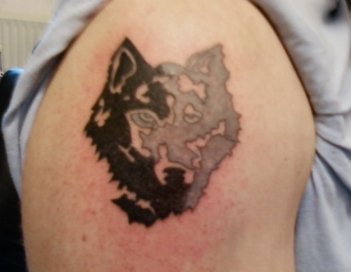

**MY WOLF TATTOO** had been in need of major restoration job for several years now. Today I finally went to "Doc Pain", the local tattoo shop, and had it redrawn.

This is a photo taken during the recoloring of the tattoo. It is really stunning to see how much it had degraded since it was originally made in 1995.

At first the tattooist wasn't quite confident that it could be salvaged. In some places the contours had almost vanished and other places the skin had some tissue scarring. I wasn't that worried though - it couldn't get much worse I reckoned.

Now its good as new, and I hope it stays good this time around. If it does, I need to find another drawing to be tattooed.
